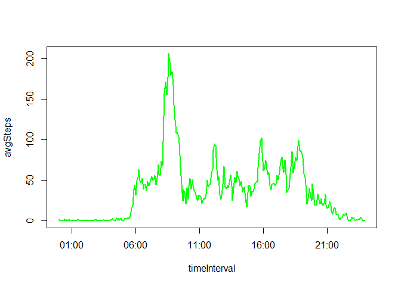

# Reproducible Research: Peer Assessment 1
RAHM  


## Loading and preprocessing the data

The activity data is presented in a file named activity.csv embedded in a zip file located at the URL provided in the assignment definition. That file has three columns of data:

1. the number of steps taken, ideally a number.
2. the date those steps were taken
3. a number indicating the interval during which those steps were taken, preferably in time format. 


```r
library(plyr)

activityDataUrl <- "https://d396qusza40orc.cloudfront.net/repdata%2Fdata%2Factivity.zip"
setInternet2(use = TRUE) # not fully sure why you need this, but the download does not work without it!
download.file(activityDataUrl, destfile = "activityData.zip")
activity <- read.csv(unzip("activityData.zip", "activity.csv"), colClasses = c("numeric", "Date", "integer"))

# convert the interval integer into a time format
activity$timeInterval <- sprintf("%04d", activity$interval)
activity$timeInterval <- as.POSIXct(format(strptime(activity$timeInterval, format="%H%M"), format = "%H:%M"), format="%H:%M")

str(activity)
```

```
## 'data.frame':	17568 obs. of  4 variables:
##  $ steps       : num  NA NA NA NA NA NA NA NA NA NA ...
##  $ date        : Date, format: "2012-10-01" "2012-10-01" ...
##  $ interval    : int  0 5 10 15 20 25 30 35 40 45 ...
##  $ timeInterval: POSIXct, format: "2015-11-06 00:00:00" "2015-11-06 00:05:00" ...
```

```r
summary(activity)
```

```
##      steps             date               interval     
##  Min.   :  0.00   Min.   :2012-10-01   Min.   :   0.0  
##  1st Qu.:  0.00   1st Qu.:2012-10-16   1st Qu.: 588.8  
##  Median :  0.00   Median :2012-10-31   Median :1177.5  
##  Mean   : 37.38   Mean   :2012-10-31   Mean   :1177.5  
##  3rd Qu.: 12.00   3rd Qu.:2012-11-15   3rd Qu.:1766.2  
##  Max.   :806.00   Max.   :2012-11-30   Max.   :2355.0  
##  NA's   :2304                                          
##   timeInterval                
##  Min.   :2015-11-06 00:00:00  
##  1st Qu.:2015-11-06 05:58:45  
##  Median :2015-11-06 11:57:30  
##  Mean   :2015-11-06 11:57:30  
##  3rd Qu.:2015-11-06 17:56:15  
##  Max.   :2015-11-06 23:55:00  
## 
```


## What is mean total number of steps taken per day?

this question has a few parts:

1. Calculate the total number of steps taken per day

2. Make a histogram of the total number of steps taken each day

3. Calculate and report the mean and median of the total number of steps taken per day


First, create a summary of total steps per day:

```r
### create a daily summary file
dailySteps <- ddply(activity, ~date, summarise, totalSteps = sum(steps))
### lets plot them
barplot(dailySteps$totalSteps, names.arg = dailySteps$date, ylab = "Steps per day", col = "green")
stepsPerDay <- mean(dailySteps[,2], na.rm = TRUE)
abline(h=stepsPerDay, col = "red", lwd = 2)
```

 

Which I think looks really interesting, although I wish I could get the dates to be vertical!


Second, plot as a histogram:

```r
hist(dailySteps$totalSteps, n = 20, col = "green")
```

 

Third, calculate the mean and the median


```r
totalSteps <- sum(dailySteps$totalSteps, na.rm = TRUE)
totalDays <-sum(!is.na(dailySteps$totalSteps))
medianSPD <- median(dailySteps$totalSteps, na.rm = TRUE)
```

So the mean number of steps per day is 10766 and the median is 10765

calculated from the total steps, 570610 taken over 53 days (without missing data).


## What is the average daily activity pattern?

The average daily activity pattern, see plot below, shows a large morning peak (morning run?, walking to work? or morning gym?) combined with mild activity through the day. 


1. Make a time series plot (i.e. type = "l") of the 5-minute interval (x-axis) and the average number of steps taken, averaged across all days (y-axis)


```r
# convert the interval codes into something plottable
# this works but its not pretty, there must be a nicer way

# summarise the data
intervalSteps <- ddply(activity,~timeInterval,summarise,avgSteps=mean(steps, na.rm = TRUE))
#create the plot
plot(intervalSteps, type = "l", col = "green", lwd = 2)
```

 

2. Which 5-minute interval, on average across all the days in the dataset, contains the maximum number of steps?


```r
# identify the maximum interval
maxInt <- format(intervalSteps[which.max(intervalSteps$avgSteps), 1], "%H:%M")
```

The answer is the 5 minute interval commencing at 08:35!

## Imputing missing values

Note that there are a number of days/intervals where there are missing values (coded as NA). The presence of missing days may introduce bias into some calculations or summaries of the data.

1. Calculate and report the total number of missing values in the dataset (i.e. the total number of rows with NAs)


```r
missingReadings <- sum(is.na(activity$steps))
missingDays <- sum(is.na(dailySteps$totalSteps))
missingIntervals <- sum(is.na(intervalSteps$avgSteps))
```

Missing data points = 2304

Missing days = 8

Missing intervals = 0

The missing data appears to represent 8 days of data, ie all readings for those days are missing and there are no other missing datapoints. 

2. Devise a strategy for filling in all of the missing values in the dataset. The strategy does not need to be sophisticated. For example, you could use the mean/median for that day, or the mean for that 5-minute interval, etc.

**I am very sceptical about any attempt to fabricate missing data particularly to "reduce bias" ... that is the first step towards academic mischief and a need to suspend belief when evaluating any conclusions that may be drawn!**

**If the sample has bias, then collect real data to reduce it ... do not fabricate data!!!**

3. Create a new dataset that is equal to the original dataset but with the missing data filled in.

See answer above, I don't think so! it cannot be equal to the original dataset if you have arbitrarily added data.

4. Make a histogram of the total number of steps taken each day and Calculate and report the mean and median total number of steps taken per day. Do these values differ from the estimates from the first part of the assignment? What is the impact of imputing missing data on the estimates of the total daily number of steps?

No!

## Are there differences in activity patterns between weekdays and weekends?
For this part the weekdays() function may be of some help here. Use the dataset with the filled-in missing values for this part.

1. Create a new factor variable in the dataset with two levels - "weekday" and "weekend" indicating whether a given date is a weekday or weekend day.


```r
weekdays <- c('Monday', 'Tuesday', 'Wednesday', 'Thursday', 'Friday')
activity$isWeekday <- factor((weekdays(activity$date) %in% weekdays), levels=c(FALSE, TRUE), labels=c('weekend', 'weekday'))
```

2. Make a panel plot containing a time series plot (i.e. type = "l") of the 5-minute interval (x-axis) and the average number of steps taken, averaged across all weekday days or weekend days (y-axis). See the README file in the GitHub repository to see an example of what this plot should look like using simulated data.


```r
# create a new dataset with the weekday and weekend interval averages only
intervalSteps2 <- ddply(activity, .(timeInterval, isWeekday), summarise, avgSteps=mean(steps, na.rm = TRUE))
# produce the panel plot
library(ggplot2)
qplot(timeInterval, avgSteps, data = intervalSteps2, facets = isWeekday~., geom = "line", col = isWeekday) + geom_line(size = 1)
```

 

From the figure above you can see that, on average, the subject started their day later on the weekend but tended to be more active throughout the day. Perhaps this is someone who walks to work, has a job in which they are not entirely desk-bound and gets a lift home and has a generally active weekend after a bit of a sleep in?

*could clean up the formatting on the x axis!*

But is there a difference between the total average steps on weekends and weekdays? The table below shows that the subject took more steps, on average, on the weekend.Is that difference statistically significant? Need to do the math, perhaps next time!


```r
test <- ddply(intervalSteps2, ~isWeekday, summarise, totalSteps = sum(avgSteps))
test
```

```
##   isWeekday totalSteps
## 1   weekend   12406.57
## 2   weekday   10177.33
```

now let's clean up by removing the data files from the workspace


```r
file.remove("activityData.zip", "activity.csv")
```

```
## [1] TRUE TRUE
```
